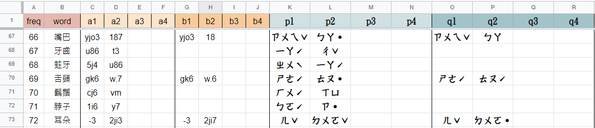

### prebuilddb

+ Const.js
  ```
  壓縮與解壓縮格式
  const CompressionMode = 'compressToUTF16';
  const DecompressionMode = 'decompressFromUTF16';
  ``` 
+ CSVToWordDataList.js
  
  ```
  使用papaparse將csv轉為db格式後，
  重建為一組JSON array回傳：
  wordDataList: 
    [
      {
        word:詞條, 
        pinyins:[[p1,p2,p3,p4],[q1,q2,q3,q4]], 
        freq: index
      },
    ...]
  
  //注意：
  //1.
  //透過for charactersLength，建出來的pinyins中，
  //p1,p2,p3,p4,q1,q2,q3,q4的空值將不會存在
  //舉例來說，兩個字的破音詞只會剩下[[p1,p2],[q1,q2]]
  //2.
  //這組JSON array還不是db格式，
  //要再經由PrebuildDB.js
  //進入WordDataListToDB.js處理過

  //被PrebuildDB.js引入
  ```
+ DBToFile.js
  ```
  用loki.js的Serialize method
  將已依csv重建的db壓縮後，
  再用file-saver存成檔案
  //被build/prebuilddb/prebuilddb.js引入
  //注意：是build階段才引入這個功能，而非model階段
  ``` 
+ GetCharacterDoc.js
  ```
  傳入characterData與db character collection
  如果db的character collection中沒有這條characterData，就加入這條characterData
  如果已經存在就不要加，防止重覆。
  加完回傳這條由loki處理過的doc

  //被WordDataListToDB.js引入
  ``` 
+ WordDataListToDB.js
  ```
  將傳入的wordDataList array重建為characterData:

  characterData = { 
    character: 此詞第p組破音的第c個字, 
    initial:, 
    media:, 
    vowel:, 
    tone: 
  } 

  characterData會經由GetCharacterDoc存入db character collection中，
  建立字庫，取回字docid。

  字docid會被依序push進wordData.pid裡(以詞查字)，
  接著用wordData存入db word collection中，
  建立詞庫，取回詞docid。

  對詞裡的每個字doc都push詞docid(以字查詞)

  以上，完成實際使用的db(words與characters)
  
  //被PrebuildDB.js引入
  ``` 
+ PrebuildDB.js
  ```
  在loki建立words collection和characters collection
  將CSV轉為wordDataList
  把wordDataList改建為實際使用的db
  ``` 